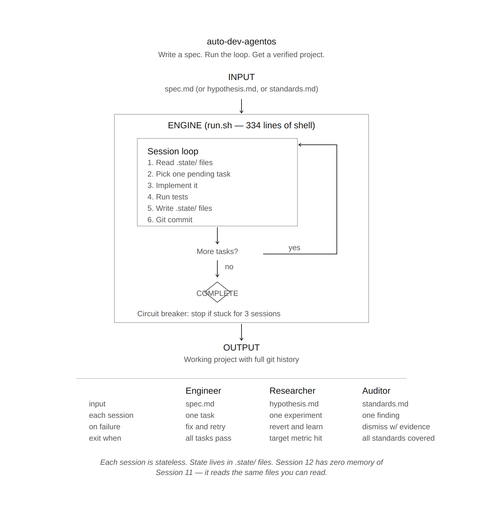

# auto-dev-agentos

[](https://github.com/leoncuhk/auto-dev-agentos/actions) [](LICENSE) [](https://www.python.org/downloads/)

Write a spec. Run the loop. Get a verified project.

A minimal, mode-pluggable engine that orchestrates LLM agents to develop projects, conduct algorithmic research, or audit codebases — autonomously.

> **Core thesis**: Reliability in long-running AI agent tasks comes from *system discipline* — deterministic orchestration, stateless sessions, file-based state, mandatory verification — not from smarter models.

## Architecture



Each session is stateless. State lives in `.state/` files. Session N+1 reads what Session N wrote. The engine decides what runs — the LLM only executes.

|              | **Engineer**         | **Researcher**        | **Auditor**              |
|--------------|----------------------|-----------------------|--------------------------|
| Input        | `spec.md`            | `hypothesis.md`       | `standards.md`           |
| Each session | One task             | One experiment        | One finding              |
| On failure   | Fix and retry        | Revert and learn      | Dismiss with evidence    |
| Exit when    | All tasks pass       | Target metric hit     | All standards covered    |
| State file   | `tasks.json`         | `journal.json`        | `findings.json`          |

## Quick Start

```bash
git clone https://github.com/leoncuhk/auto-dev-agentos
cd auto-dev-agentos

# See what's available
./run.sh --list-modes

# Preview without invoking Claude (zero cost)
./run.sh --dry-run examples/todo-app

# Write a spec, run the engine
mkdir my-project && echo "# My App\nBuild a REST API..." > my-project/spec.md
./run.sh my-project
```

## Prerequisites

**Shell engine** (`run.sh`):
```bash
brew install jq                         # macOS (or: apt-get install jq)
npm install -g @anthropic-ai/claude-code # Claude Code CLI
```

**SDK engine** (`run.py` — adds strategic review, hooks, cost tracking):
```bash
pip install claude-agent-sdk            # Python 3.10+
```

## Usage

```bash
# Shell engine
./run.sh [--mode <mode>] [--dry-run] <project-dir> [max-sessions]

# SDK engine
python run.py [--mode <mode>] [--dry-run] <project-dir> [options]
```

| Flag | Default | Description |
|------|---------|-------------|
| `--mode` | `engineer` | `engineer`, `researcher`, or `auditor` |
| `--dry-run` | | Preview what would run, no LLM calls |
| `--max-sessions` | `50` | Session limit |
| `--orient-interval` | `10` | Strategic review interval (SDK engine only) |

| Env Variable | Default | Description |
|-------------|---------|-------------|
| `PAUSE_SEC` | `5` | Seconds between sessions |
| `REVIEW_INTERVAL` | `5` | Tactical review every N sessions |
| `NO_PROGRESS_MAX` | `3` | Stuck detection threshold |

## Example: Researcher Mode

The [quant-lab demo](examples/quant-lab/) shows a complete research run — optimizing a trading strategy's Sharpe Ratio from 0.84 to 1.89 across 6 experiments:

| Experiment | Approach | Result | Decision |
|-----------|----------|--------|----------|
| EXP-001 | Optimize MA parameters | 0.84 → 1.37 | Accepted |
| EXP-002 | MACD confirmation | 1.37 → 0.72 | Rejected (double-lag) |
| EXP-003 | RSI position sizing | 1.37 → 1.33 | Rejected (fights trend) |
| EXP-004 | Stop-loss | Error | Reverted (framework limitation) |
| EXP-005 | Momentum + conviction sizing | 1.37 → 1.89 | Accepted — target exceeded |
| EXP-006 | Adaptive MA windows | 1.89 → 1.15 | Rejected (boundary instability) |

Failed experiments (002, 003, 004) directly informed the winning experiment (005). The loop works because failures accumulate as knowledge, not waste.

```bash
cd examples/quant-lab && python run_backtest.py   # verify: Sharpe = 1.89
cat .state/journal.json                            # full experiment log
cat .state/progress.md                             # session-by-session narrative
```

## Project Structure

```
auto-dev-agentos/
├── run.sh              # Shell engine (single-loop)
├── run.py              # SDK engine (dual-loop, hooks, cost tracking)
├── core.py             # Shared pure functions
├── modes/
│   ├── engineer/       # spec.md → tasks → implement → verify
│   ├── researcher/     # hypothesis.md → experiment → evaluate → learn
│   └── auditor/        # standards.md → scan → analyze → report
├── tests/              # Unit tests (no SDK dependency)
├── docs/               # Design rationale and methodology
└── examples/           # Demo projects (todo-app, quant-lab, audit-demo)
```

## Creating a New Mode

Create `modes/<name>/` with `mode.conf`, `CLAUDE.md`, and `prompts/`. The engine picks up new modes automatically. See [CONTRIBUTING.md](CONTRIBUTING.md).

## Design Principles

These address the [six failure modes](https://arxiv.org/abs/2601.03315) of autonomous LLM agents:

| Principle | Failure mode it solves |
|-----------|----------------------|
| Stateless sessions | Context degradation — each session starts fresh |
| File-based state | Context window limits — state survives indefinitely |
| One task per session | Implementation drift — no room to simplify under pressure |
| Mandatory verification | Overexcitement — metrics decide, not LLM self-assessment |
| Circuit breaker | Infinite loops — stuck detection + max sessions |
| Deterministic orchestration | All six — shell script decides flow, not LLM |

## FAQ

**How much does it cost?**
Each session is one Claude Code invocation. `--dry-run` previews at zero cost. `MAX_SESSIONS` caps total runs.

**Why `--dangerously-skip-permissions`?**
Headless mode — no human to click "approve." Safety comes from architecture: deterministic orchestration, one-task blast radius, git-versioned state, circuit breakers.

**Can I resume after Ctrl+C?**
Yes. Same command again. The engine re-reads `.state/` and continues.

**Can I use a different LLM?**
Replace `claude -p` in `run.sh` with your CLI tool. The architecture is LLM-agnostic; the current implementation uses Claude.

## References

**Design:**
- [Design Rationale](docs/design-rationale.md) — Why this architecture, what alternatives were considered
- [Stateless Agent Architecture](docs/stateless-agent-architecture.md) — Full argument for stateless sessions
- [Dual-Loop Architecture](docs/dual-loop-architecture.md) — Strategic orientation via OODA outer loop

**Research:**
- [Why LLMs Aren't Scientists Yet](https://arxiv.org/abs/2601.03315) — Six failure modes in autonomous LLM research (arXiv, 2026)
- [Building Effective AI Coding Agents](https://arxiv.org/abs/2603.05344) — Scaffolding + harness architecture (arXiv, 2026)
- [Anthropic Agentic Coding Trends](https://resources.anthropic.com/2026-agentic-coding-trends-report) — Industry landscape (2026)

**Related tools:**
- [Claude Code](https://docs.anthropic.com/en/docs/claude-code) — Terminal-native AI agent by Anthropic
- [Claude Agent SDK](https://github.com/anthropics/claude-agent-sdk-python) — Python SDK for agent loops
- [GitHub Spec Kit](https://github.com/github/spec-kit) — Spec-driven development toolkit
- [OpenHands](https://github.com/All-Hands-AI/OpenHands) — Full-platform autonomous coding agent
- [SWE-agent](https://github.com/SWE-agent/SWE-agent) — GitHub issue resolution agent
- [Aider](https://github.com/Aider-AI/aider) — Interactive AI pair programming
- [Sakana AI Scientist v2](https://github.com/SakanaAI/AI-Scientist-v2) — Autonomous research via tree search
- [Gas Town](https://github.com/steveyegge/gastown) — Multi-agent parallel orchestration
- [Goose](https://github.com/block/goose) — MCP-native extensible agent framework
- [BMAD](https://github.com/24601/BMAD-AT-CLAUDE) — Multi-agent development method (26 agents)

## Contributing

See [CONTRIBUTING.md](CONTRIBUTING.md). Run `python tests/test_run.py` before submitting.

## License

AGPL-3.0. See [LICENSE](LICENSE).
